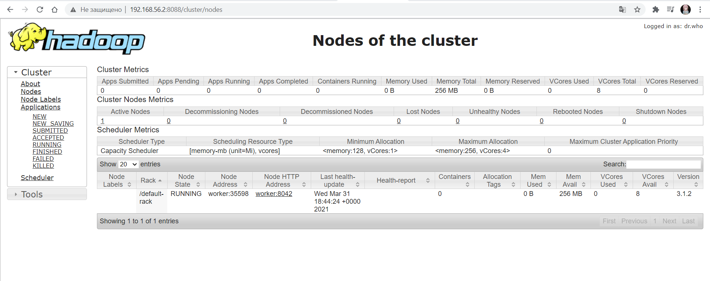
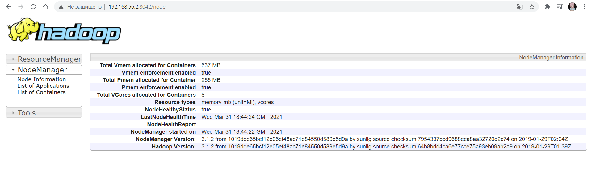

# 1-Docker

# Создание своей подсети

Перед запуском контнейнеров необходимо создать свою подсеть **172.19.0.0/24**.

Не обязательно с маской /24, можно с /30. 

```
docker network create --subnet 172.19.0.0/24 my-network
```

# Headnode

Получение:

```
$ docker pull dahachm/hadoop:headnode
```

**headnode** - главная нода HDFS-кластера, при старте контейнера запускаются NameNode(HDFS) и ResourceManager(YARN). 

IP адрес - 172.19.0.2 (headnode).

Запуск контейнера **headnode**: 
```
$ docker run -v /opt/namenode-dir:/opt/namenode-dir -p 8088:8088 -itP --name headnode --network my-network --ip 172.19.0.2 --hostname headnode hadoop:headnode
```

  - **-v** - подключение вольюмов: 

      *<каталог хостовой системы, где нужно сохранить данные контейнера>*:*<путь монтирования каталога в контейнере>*
      
      Если не указывать этот параметр отдельно, docker сам выделит вольюм. Путь к нему можно будет посмотреть с помощью команды `docker inspect hadoop:headnode | grep Volumes`. 

  - **-p** - проброс портов из контейнера в хост систему:
 
      *<порт_хоста>*:*<порт_контейнера>*

      Если не указывать отдельно, куда перенаправлять трафик с некоторых портов (в данном случае для удобство отдельно указываем порт доступа к WebUI RewourceManager'а), то
      docker сам перенаправит порты, перечисленные в EXPOSE, на свободные в хостовой системе (при указании параметра **-P**). Посмотреть правила проброса портов запущенного
      контейнера можно с помощью команды `docker ps`.
      
  - **--netwrok** и  **--ip** - указываем созданную ранее собственную сеть и адрес, назначаемый контейнеру в этой сети
      
      НЕ ПРОПУСКАТЬ ЭТИ ПАРАМЕТРЫ, так как при настройке контейнеров IP адреса **headnode** и **worker** записываются в */etc/hosts*, чтобы указанные имена правильно резолвились и ноды видели друг друга!!! 

# Worker

Получение: 

```
$ docker pull dahachm/hadoop:worker
```

**worker** - первая (и единственная) slave-нода кластера, при старте контейнера запускаются DataNode (HDFS) и NodeManager (YARN).

IP адрес - 172.19.0.3 (wworker).

Запуск контейнера **worker**:
```
$ docker run -v /opt/nodemanager-log-dir:/opt/nodemanager-log-dir -p 8042:8042 -itP --name worker --network my-network --ip 172.19.0.3 --hostname worker hadoop:worker
```

Описание и назначение параметров запуска **worker** почти совпадает с описанием выше, добавлю только следующее:
  - каталогов для монтирования (вольюмы) 3 штуки:
      - /opt/datanode-dir
      - /opt/nodemanager-local-dir
      - /opt/nodemanager-log-dir
    
    Если не указывать с парметром **-v** путь к вольюму в хостовой системе, docker сам выделит под него каталог, найти который, опять-таки, можно через вызов `docker inspect` (см.выше).
  - WebUI NodeManager'а доступен на порту 8042, для удобства предлагаю отдельно указать его с параметром **-p** при запуске контейнера
  - Указание сети и IP адреса НЕ ПРОПУСКАТЬ

## Результат

Если необходимо - настроить проброс портов с ВМ.

В браузере: 

localhost:8088 - ResourceManager WebUI

localhost:8042 - NodeManager WebUI

Результаты:





## Docker файл для сборки образа headnode
см. [*headnode_dockerfile*](headnode_dockerfile)

## Docker файл для сборки образа worker
см. [*worker_dockerfile*](worker_dockerfile)
