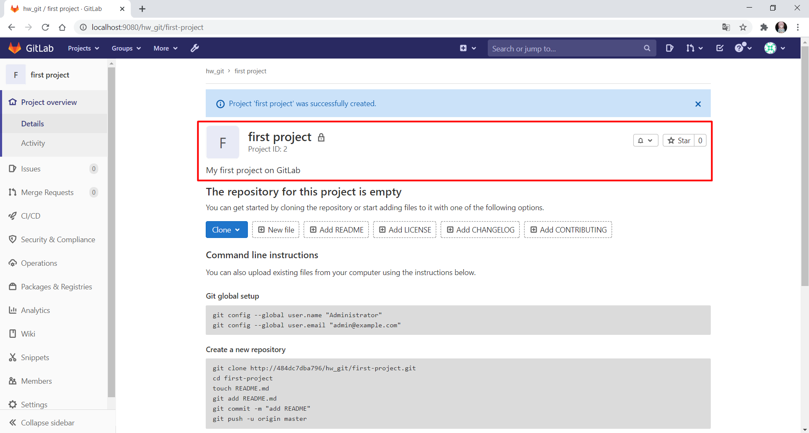

# 1
  ## 1. Create local repository named **lection_git_hw**
    
   ```
   $ git init lection_git_hw
   ```
    
   

  ## 2. Create file "homework" in this repo and commit it in master branch
    
   ```
   $ touch homework
   $ git add homework
   ```

   

   ```
   $ git commit -m "Add homework file"
   ```

   

  ## 3. Create branch "hw_git" and insert anything in the file and commit these changes to this branch
    
   ```
   $ git branch hw_git
   $ git checkout hw_git
   $ echo "This text was added on hw_git branch" >> homework
   ```

   

   ```
   $ git add homework
   $ git commit -m "Add some test to homework file" 
   ```

   

   As I made a small mistake in commit text, I want to edit it by next command:

   ```
   $ git commit --amend -m "Add some text to homework file"
   ```

   

  ## 4. Switch back to master branch and add anything else to the empty file "homework" there too
    
   ```
   $ git checkout master
   $ echo "This text was added on master branch."
   ```

   

   ```
   $ git add homework
   $ git commit -m "Add some text to homework file"
   ```

  ## 5. Merge branch "hw_git" to "master", keep only changes from "hw_git" branch
    
   ```
   $ git merge hw_git
   ```

   

   ```
   $ vim homework
   ```

   

   Leave only changes from **hw_git** branchL

   

   ```
   $ git add homework
   $ git commit -m "Add some text to homework file"
   $ git merge hw_git
   ```

   

  ## 6. Switch to "hw_git" branch again and create new file "temp_file" and commit it
    
   ```
   $ git checkout hw_git
   $ touch temp_file
   $ git add temp_file
   $ git commit -m "Add temp_file"
   ```

   

  ## 7. Revert to the first commit in "hw_git" branch
    
   ```
   $ git log --decorate
   ```

   

   ```
   $ git checkout 7afed2e
   ```

   

   There is no *temp_file* , *homework* is empty:

   

   There is another way to replace HEAD to the first commit in the branch:

   ```
   $ git reset --hard HEAD~2
   ```

   

   The difference between using **checkout** and **reset** commands is that **checkout** replace HEAD pointer in *detached HEAD* state and **reset** update both HEAD and branch state. 

   **checkout** is considered to be *working-directory safe* as it checks up on files that have been changed and leave them in the working directory.

   There is a great cheat-sheet table in [Git Documetation](https://git-scm.com/book/en/v2/Git-Tools-Reset-Demystified):

   > The “HEAD” column reads “REF” if that command moves the reference (branch) that HEAD points to, and “HEAD” if it moves HEAD itself. Pay especial attention to the 'WD Safe?' column — if it says NO, take a second to think before running that command.

    

    
# 2
  ## 1. Create empty repository "lection_git_hw" on in Github
  ## 2. Set remote from your local repo from task 1 to this new repo
      
   ```
   $ git remote add origin https://github.com/dahachm/lection_git_hw.git
   ```  

   

  ## 3. Push all branches to the remote repo
    
   ```
   $ git push -u origin master
   $ git push -u origin hw_git
   ```

   

   

  ## 4. Change everything in file "homework" in branch "hw_git" to one line "Hello Github", commit it and push
    
   ```
   $ git checkout hw_git
   $ echo "Hello GitHub" > homework
   $ git add homework
   $ git commit -m "Change content of homework file"
   $ git push -u origin hw_git
   ```
   

  ## 5. Create Pull Request from branch "hw_git" to the master branch and assign me as reviewer to this merge request

   

# 3
  ## 1. Set up Gitlab CE in docker container
    
   ```
   $ docker run -d -p 80 -p 22 gitlab/gitlab-ce:latest
   ```

   

   Configure port forwarding to host machine ports 9080 and 9022 to have access in order to WebUI from host machine's browser: (localhost:9080):

   

  ## 2. Log in as root
    
   
   
   
    
  ## 3. Create group "hw_git"
    
   
   
   

  ## 4. Create two users: maintainer and developer
    
   
   
   
   
   
   
   

  ## 5. Add these users to the group and set them proper permissions in the group (maintainer – maintainer, developer – developer)
    
   
   
   
   
   

  ## 6. Create new project with any name
    
   
   
   


  ## 7. Create all branches for GitFlow in this project (you can create one feature and one release branch and don't create hotfix branch)
    
   
   
   
   
   
   
   

  ## 8. Protect master branch to allow only maintainers to merge into it, and restrict all to push there
    
   
   
   
   

  ## 9. Protect release branches by wildcard (release-* for example) and allow only maintainers to merge into it
    
   
   

  ## 10. Protect develop branch to allow everyone to create Merge Request into it
    
   
   

  ## 11. Allow anyone do anything in branches like "feature-*"
    
   
    
  ***
   
   Only owner and maintainer are allowed to delete protected branches (except default one - master) using WebUI:

   
   
   

   Let's test new access settings.

   Try to push into *master* branch by *maintainer* (FAIL):

   

   Try to push into *feature-#23* (new "feature*" branch) by *developer* (SUCCESS):

   

   Try to merge *feature-#23* into *release* and push into remote *release* branch by *developer* (FAIL):

   


# EXTRA
  Add TravisCI to Github repo from the first task and Trigger CI on each commit to any branch.

   .travis.yml:

   ```yml
   language: bash
 
   script:
     - echo "Hello World"
   ```
  
   The result:
    
   

   


